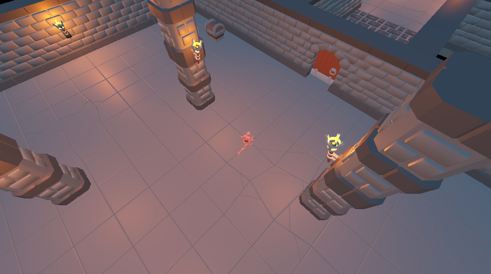

<h1 align="center">Ancient Secrets</h1>
 

  

  Discover the Ancient Secrets.
   
   
  <a href="https://guibdbello.itch.io/ancient-secrets">Play Game</a>
  ·
  <a href="https://github.com/GuiBDBello/ancient-secrets/issues/new?labels=bug&template=bug-report---.md">Report Bug</a>
  ·
  <a href="https://github.com/GuiBDBello/ancient-secrets/issues/new?labels=enhancement&template=feature-request---.md">Request Feature</a>

## Table of Contents

<ol>
  <li><a href="#introduction">Introduction</a></li>
  <li><a href="#getting-started">Getting Started</a></li>
  <li><a href="#build-process">Build Process</a></li>
  <li><a href="#acknowledgments">Acknowledgments</a></li>
  <li><a href="#license">License</a></li>
</ol>

## Introduction

Explore the ruins of an old civilization to discover the Ancient Secrets of our history!

  

### How to Play

- **WASD**: Move.
- **E** and **Left Mouse Button**: Interact with objects.

### Game Jam

This game was made for the game jam [Godot Wild Jam #57](https://itch.io/jam/godot-wild-jam-57), which took place between May 12th and May 21st of 2023.

The theme of the Jam was: **Forgotten Knowledge**.

(<a href="#readme-top">back to top</a>)

## Getting Started

To get a local copy up and running follow the steps below.

### Prerequisites

1. [Godot](https://godotengine.org/)

### Configuration

1. Clone repository: `git clone https://github.com/GuiBDBello/ancient-secrets.git`.
1. Import the project in Godot: `Import > Select the project folder`.
1. Double-click the project to open.

(<a href="#readme-top">back to top</a>)

## Build Process

1. In Godot, select `Project > Export...`.
1. Select the `Presets`.
1. Click on `Export Project...`.
1. Select the folder and press `Save`.

(<a href="#readme-top">back to top</a>)

## Acknowledgments

List of references that were useful in the making of this project:

* [Mixamo](https://www.mixamo.com/#/)
* Lukky's [Godot 4 RPG Controller Tutorial (2023)](https://www.youtube.com/watch?v=0T-FMkSru64)
* Queble's [Godot 4.0 | Interaction Tutorial (🤯)](https://www.youtube.com/watch?v=_57alDBagSY)

### Assets

| Name | Type | Creator | Source |
| --- | --- | --- | --- |
| Dungeon Asset Pack | 3D Model | [KayKit](https://kaylousberg.itch.io/) | [Itch.io](https://kaylousberg.itch.io/kaykit-dungeon) |
| Mixamo | 3D Model & Animation | [Adobe](https://www.adobe.com/) | [Mixamo](https://www.mixamo.com/#/) |
| Prototype Textures | Texture | [Kenney](https://kenney.nl/) | [Kenney](https://kenney.nl/assets/prototype-textures) |

(<a href="#readme-top">back to top</a>)

## License

Distributed under the MIT License. See [LICENSE](./LICENSE) for more information.

(<a href="#readme-top">back to top</a>)

